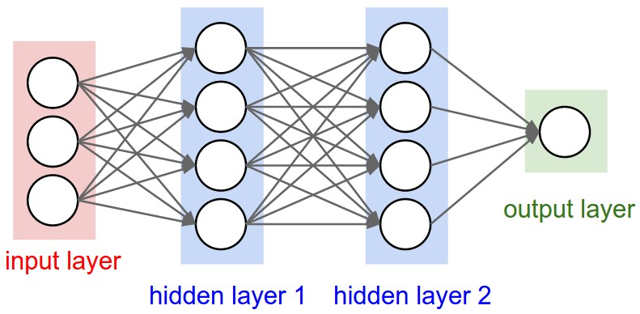
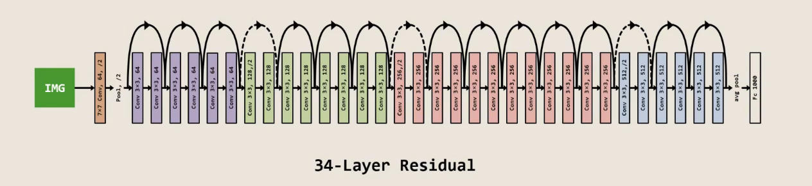
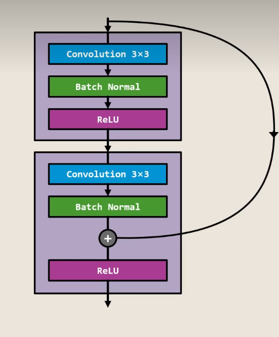

**Attention Is All You Need**

**核心思想**：

传统的CNN是图像识别的主力军，但是传统CNN在构建网络时不能构建过深，不然会出现因为网络过深而导致性能下降与训练困难的问题。但是具有“残差连接”优势的ResNet完美解决了以上出现的问题。

**我的思考**：

1.传统CNN的局限与不足

先介绍一下传统CNN网络的结构

如图所示，数据从input处输入，经过隐藏层的特征提取与分析，最终在output处输出。那依据结构来看，应该是隐藏层数越多，最后模型预测就越准确才对。但实际上并不是这样，在大约20层之后，随着层数增加，模型的性能反而会下降。其根本原因是数据在逐层传播时，每当含有数据的方阵在经过一层隐藏层的卷积与池化时，其包含的信息都会被提取到一张尺寸更小的方阵上。虽然保留了重要信息，但其过程中总有信息丢失。也就是说，传统CNN网络并不能通过加深网络来进行更加准确的识别与预测。

2.残差连接的作用与ResNet结构

为了避免上文中出现的问题，ResNet网络引入了残差连接机制。其大体结构如图所示

其箭头连接处结构如图

这个机制可以让网络从学习原始数据本身转为学习数据与其最终映射的残差。这样在层与层之间的数据传递中，就算每层学习效果再差最终也只会输出原始数据，而不是像传统CNN一样输出质量差过原始数据的数据。

> 但当我之前像AI工具询问ResNet相关结构时，AI向我回答残差连接“完美解决了信息丢失的问题”，但这个结构就我现有水平来看，也只是延缓了信息丢失严重的层数而已。那ResNet为什么还能构建比原本CNN更深的网络呢？

**结语**

至此，我的寒假考核任务便到此结束。在整个寒假过程中，我经历过一开始面对代码编写问题的手足无措，对MLP与CNN网络工作原理的不解，在一遍遍修理代码bug的烦躁，以及在等待模型运行结果时的迷茫。现在回顾我的整个寒假任务，我还有许多没能做好的地方。但学习一项新事物也正是在不断的尝试中成长。感谢实验室的各位能提供我这样一个机会与动力源来尝试这些。

