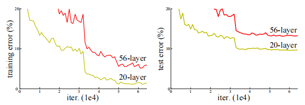
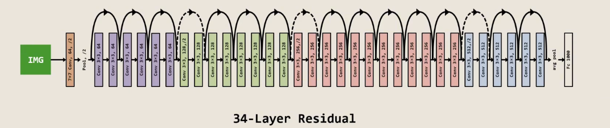
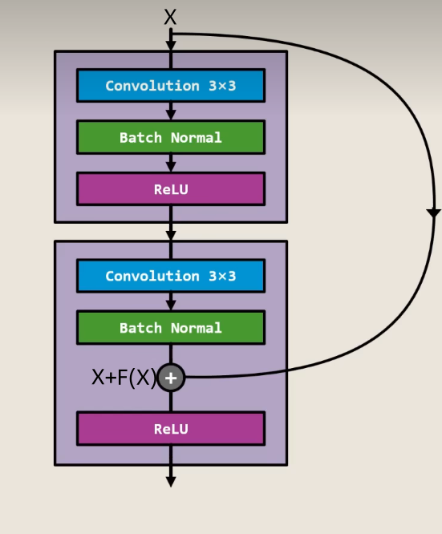

# Deep Residual Learning for Image Recognition

## 核心思想

该论文介绍了关于普通网络在网络加深时会遇到的准确率降低问题，并引入残差连接（Residual Connection）来解决这个问题。

## 我的思考

### 1.CNN网络在网络加深时面临的问题

这篇文章中提到，卷积神经网络的好处就是可以通过加深网络来提高模型的学习能力与准确性。且在理论上来说，即使在增加层数已经不能提升准确率时，新增加的层也会在训练过程中由优化算法训练成恒等映射层，也就是说不会导致准确率的降低。但随着层数的提升，结果如图所示。

网络并没有按照预期所想的那样稳步提升自身准确率，就连稳定准确率也做不到，反而会导致学习率的降低。并且不是像过拟合现象那种训练集准确率不变但测试集准确率降低的情况，而是训练集和测试集准确率双重降低的奇怪现象，这就表明了优化算法并不能做到这件事情，需要其他的方法解决。

### 2.残差连接的作用

先展示一下没有残差连接的网络架构

可以看到，该网络由34个使用3x3的卷积核的卷积层构成。在加上残差连接之后，网络的结构并不会出现太大变化，如下图所示。

其中，箭头连接处发生的事情如下图所示。

可以看到，浅层网络输出X在经过两层卷积之后变为了F(X)，但在经过第二层时与X相加之后才经过激活函数。

而在这其中所学习到的F(X)=底层映射函数H(X)—X的结果。也就是通过这种类似在层与层之间加入功能与恒等映射层类似的结构，保证了每一层网络在训练时得到的结果绝对不会比上一层更差。这就是残差连接的作用。

### 3.残差连接的优势

残差连接这一方法有效地解决了深层网络训练时出现的准确率降低的问题，使加深网络来提高模型准确率成为可能。并且，由于新增操作仅有加法，所以在使用残差连接时不会导致模型复杂度变高与计算量暴增的问题。而且该方法不改变原网络的主要结构，所以对于先前没有使用该方法的CNN网络也可以很方便地添加这个方法。

## 

## 结语

至此，我的寒假考核任务便到此结束。在整个寒假过程中，我经历过一开始面对代码编写问题的手足无措，对MLP与CNN网络工作原理的不解，在一遍遍修理代码bug的烦躁，以及在等待模型运行结果时的迷茫。现在回顾我的整个寒假任务，我还有许多没能做好的地方。但学习一项新事物也正是在不断的尝试中成长。感谢实验室的各位能提供我这样一个机会与动力源来尝试这些。