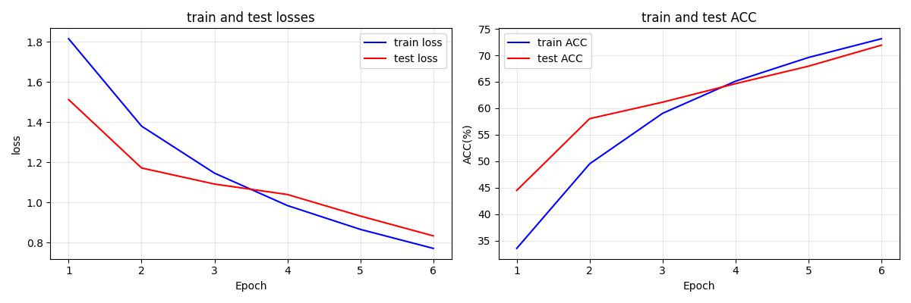
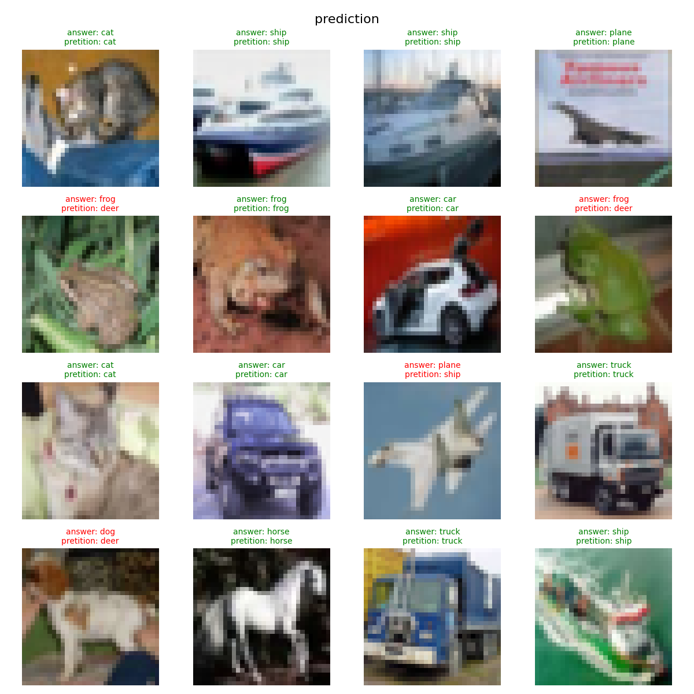
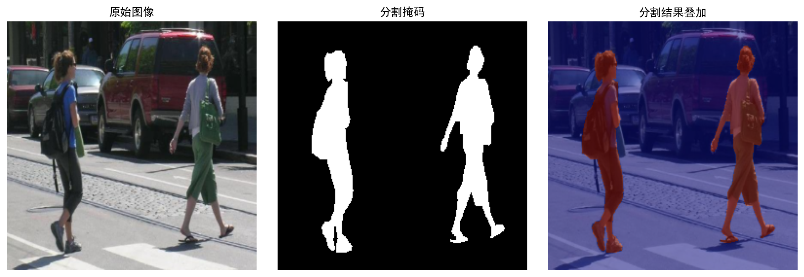

**任务一：**

在b站查找相关教程之后，我清楚自己电脑不具备安装CUDA版本PyTorch的设备条件，所以我选择安装cpu版本的PyTorch。因此在后续的训练模型过程中我往往要等上很长一段时间才能得到最终结果。

而在安装Anaconda并安装PyTorch时，我遇到了较多问题。诸如下载速度较慢，不知道环境构建意味着什么，以及不会正确将环境导入Pycharm进行代码运行。下载速度的问题，在我注意到相关速度问题之后我便着手开始更换VPN节点，好在更换更低延迟的节点之后该问题便迎刃而解；对于环境构建问题，在我翻阅b站上的大多数教程，并加以Deepseek等工具的帮助，我最终解决了这个问题。

*AI使用说明：在此环节中，我认为AI在处理一些不能直接搜索得到解答的问题很有用，但是存在部分解答方案过于陈旧的情况。如下载Pytorch时出现的建议是依据旧版网站提供的.*

*如果没有AI，我认为我应该能够仅凭网络上的教程完成这一部分。*

**任务二:**

在这个任务中，由于对MLP不是非常了解，我先去b站了解了一下该模型的工作原理，之后在Deepseek的指导之下，我构建了一个能够较顺畅完成该任务的MLP模型。在AI工具的辅助下，我最终选定构建一个具有五层隐藏层的MLP，维数分别为1，2，4，2，1，并使用AI推荐的ReLU激活函数与MSELoss函数，可惜在该框架下，任务要求提到的不同epoch下的拟合曲线并未出现明显差别。

当我将学习率调整到非常大时，我观察到Loss曲线变化非常迅速且波动较大。这是因为学习率过大导致模型在训练过程中受单次训练影响过大，所以拟合效果会随着单次训练的数据可靠性而出现较大波动。

而当我将学习率调整到非常小的时候，我观察到Loss曲线变化非常缓慢，且没有产生什么波动。这是因为学习率过小使模型在训练过程中的调整幅度受单次影响较小，当训练次数足够大时才能更好拟合原函数。

*AI使用说明：我认为AI在此部分用于写样板代码非常有用。对于我这样的没有Python编程基础的人而言，用AI来提供一份样版代码然后反向研究是一种非常有效的学习方式。但是AI提供的样板代码不能直接使用，需要我自行解决其中存在的bug才能使用。*

*如果没有AI，那么我应该能凭借网络上的现有MLP方案编写出完整代码*。

**任务三：**

当我着手这项任务时，我并没有选择及格线所提到的模型，而是选择构建进阶线中提到的ResNet。由于完全没有过编写这种模型的经验，于是我便通过AI提供的大致框架，在自己对lr与层数的微调之下完成了这一具有残差连接特点的CNN模型。

以下是我的Loss曲线和最终准确率

*AI使用说明：在此部分，我认为AI在解释概念方面很有用。当我不理解CNN和残差连接的原理时，AI能够为我提供一份形象的解答，让我在后续修改bug中能够有的放矢。但是AI往往需要我多次重复地描述问题才能给出我满意的解答，这是我认为AI失效的地方。*

*如果没有AI，我也会通过之前在b站等平台看到的他人编写的现有方案而写出自己的完整代码。*

**任务四：**

相比于任务三，我在该任务中加入了考核要求中提到的Warmup与Mixup部分；而在结构方面我尝试过考核要求中提到的加深网络，改变卷积核大小两种修改。而我在任务三选用的ResNet网络本身就具有残差连接机制,因此我并没有额外添加该机制。

关于Warmup的工程原理：在训练初期时，模型并未得到充分训练，因此使用Warmup可以减少模型在训练初期找错训练方向，通过逐步变大的学习率让模型快速找到正确训练方向，避免耗费过多训练次数。

关于Mixup的工程原理：通过随机混合两个样本，让模型能够做出更加模糊的判断，使模型在以后识别更加模棱两可的图片时做出的判断更加稳定。

改动的效果虽有好有坏，但效果都是显著的：比如在相同的训练次数下，加入Warmup和Mixup之前，我的模型仅有70%左右的准确率；但加入之后准确率可以冲击90%

关于加深网络，由于我在尝试之后训练一次的时间大幅延长，因此最终我放弃了这个修改方案。

由于我的电脑性能并不是很好，我最先尝试的就是修改卷积核的大小与步长，尝试在尽可能不改变精度的情况下减少训练时间。但是在尝试修改卷积核大小从3到4，步长从2到3之后，准确率出现了巨幅下跌，因此我也放弃了该方案。

在尝试加入Mixup机制时，我遇到了准确率断崖式下跌的情况。好在多方面求证和在AI工具的辅助之下，我搞清楚了准确率下降的原因——这是因为我仅仅只添加的将两个样本随机混合的函数，但却并没有对依赖样本标签来计算准确率的计算函数作出相应修改导致的。

*AI使用说明：在此环节中，我认为AI在提供多样化方案上非常有用。当我还不理解Warmup和Mixup的实现方法时，AI便可以提供多种方案供我参考与使用。但是AI提供的所有方案并不是能够直接使用的，需要自己自行修改方案中存在的bug才能使用。*

*如果没有AI，我应该能通过传统搜索引擎完成概念的理解，但具体实现方面应该要花些功夫。*

**任务五：**

对于这个任务，我选择了技术路线中提到的自行搭建一个U-Net网络的方法。以下是我的训练结果

*AI使用说明：在此部分中，我认为AI最有用的是解释网络结构。起初我并不知道U-Net网络是如何运行的，但通过AI的解释，我明白了该网络的运行逻辑以及名称来源，缩短了我再去学习了解的时间。*

*如果没有AI，那么我应该也能通过b站等其他途径完整了解U-Net网络结构。*